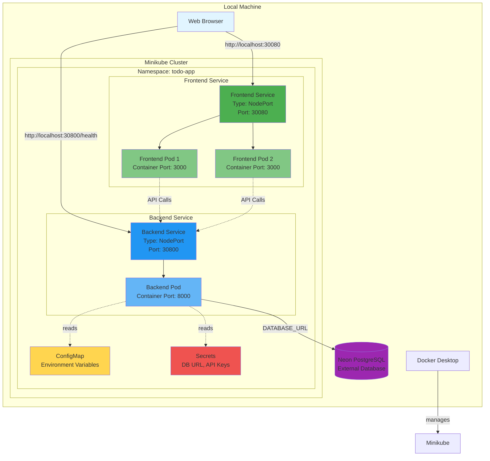
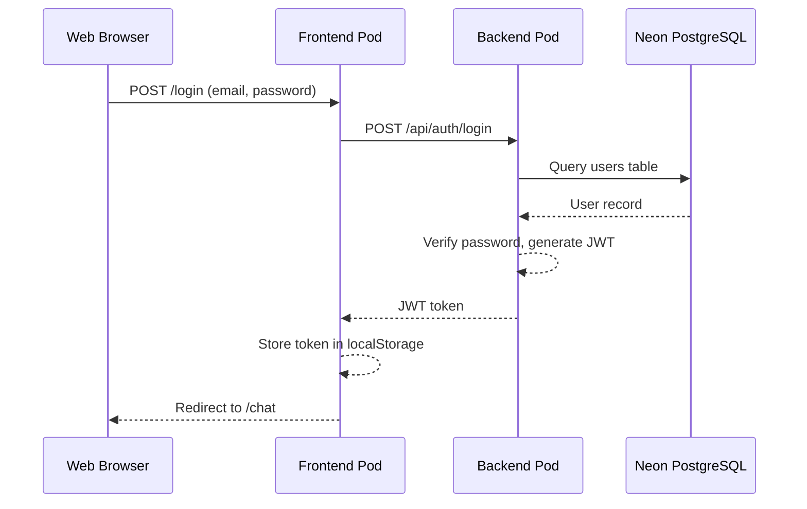
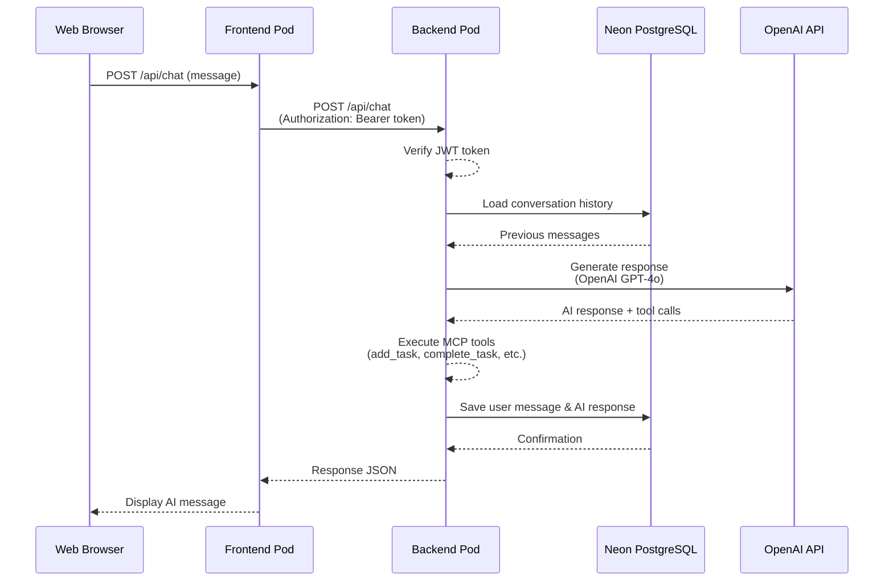
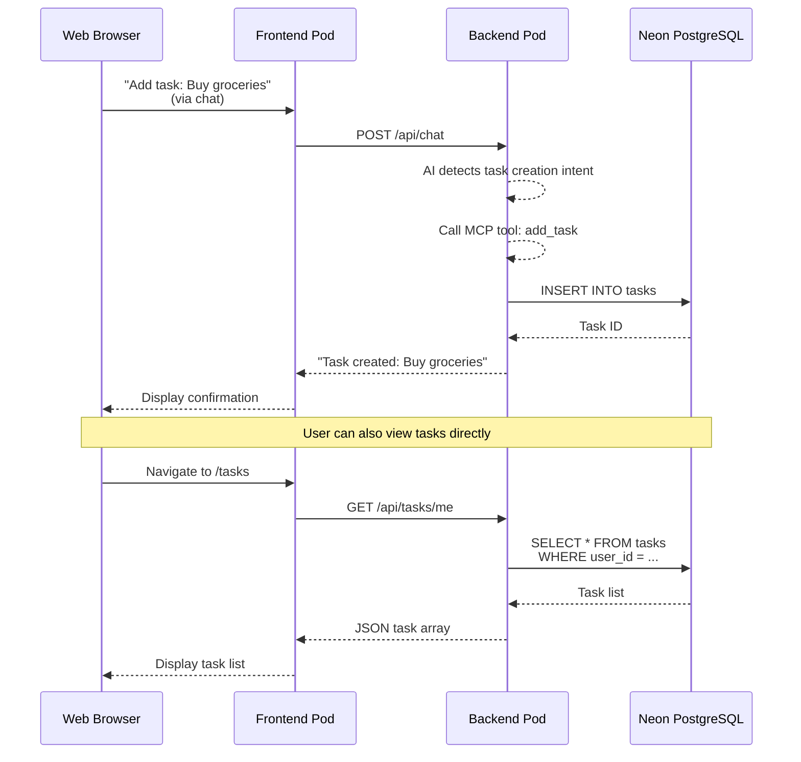
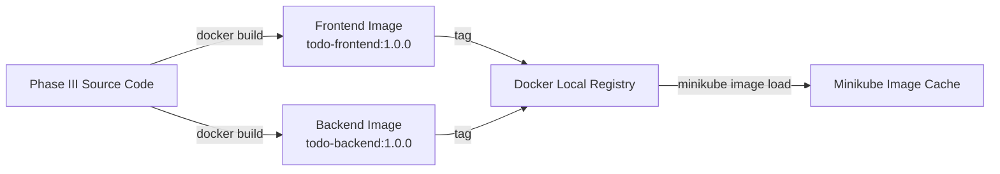
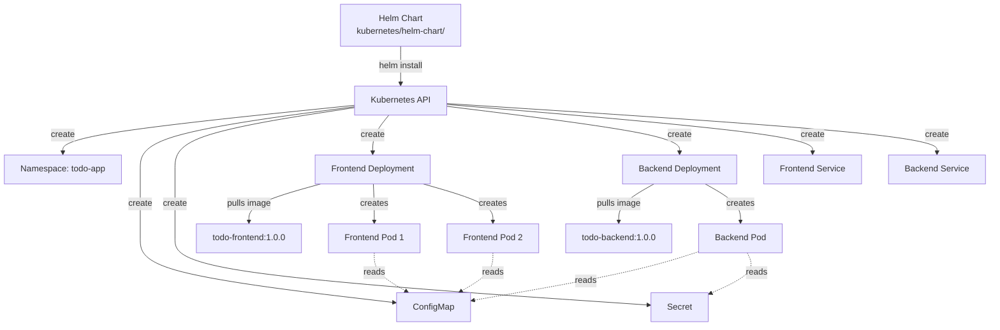

# Deployment Architecture: Local Kubernetes for Todo Chatbot

**Feature**: Phase IV - Local Kubernetes Deployment
**Date**: 2026-01-28
**Status**: Phase 1 Design Artifact

---

## Architecture Overview

This document describes the deployment architecture for the Todo Chatbot application running on a local Kubernetes cluster (Minikube). The architecture follows cloud-native best practices with containerized services, declarative infrastructure, and Helm-based deployment management.

---

## High-Level Architecture Diagram



---

## Component Details

### 1. Local Machine Environment

**Docker Desktop**:
- Container runtime for building and running images
- Provides Kubernetes cluster (alternative to Minikube)
- Resource allocation: 2-4 CPU cores, 4-8GB RAM recommended

**Minikube Cluster**:
- Local Kubernetes cluster for development and testing
- Configuration: `minikube start --cpus=2 --memory=4096 --disk-size=20gb`
- Single-node cluster (master + worker on same node)

**Web Browser**:
- User interface access point
- Connects to services via NodePort on localhost
- Frontend: `http://localhost:30080`
- Backend: `http://localhost:30800`

---

### 2. Kubernetes Namespace: `todo-app`

**Purpose**: Logical isolation for Todo Chatbot resources

**Resources Contained**:
- 2 Deployments (frontend, backend)
- 2 Services (frontend, backend)
- 1 ConfigMap (environment configuration)
- 1 Secret (sensitive credentials)

**Namespace Benefits**:
- Resource isolation from other applications
- RBAC boundaries (future enhancement)
- Easy cleanup: `kubectl delete namespace todo-app`

---

### 3. Frontend Service

**Kubernetes Deployment**:
```yaml
Name: todo-chatbot-frontend
Replicas: 2
Strategy: RollingUpdate (maxSurge: 1, maxUnavailable: 0)
```

**Container Specification**:
- Image: `todo-frontend:1.0.0`
- Base: node:18-alpine
- Port: 3000
- Resources:
  - Request: 100m CPU, 256Mi memory
  - Limit: 500m CPU, 512Mi memory
- Health Checks:
  - Liveness: `GET /` every 10s
  - Readiness: `GET /` every 10s

**Service Specification**:
- Type: NodePort
- NodePort: 30080 (external access)
- Target Port: 3000 (container port)
- Selector: `app=frontend`

**Traffic Flow**:
1. Browser → `http://localhost:30080`
2. NodePort 30080 → Service `todo-chatbot-frontend`
3. Service → Load balances across 2 frontend pods
4. Pod → Next.js application on port 3000

---

### 4. Backend Service

**Kubernetes Deployment**:
```yaml
Name: todo-chatbot-backend
Replicas: 1
Strategy: RollingUpdate (maxSurge: 1, maxUnavailable: 0)
```

**Container Specification**:
- Image: `todo-backend:1.0.0`
- Base: python:3.11-slim
- Port: 8000
- Resources:
  - Request: 200m CPU, 512Mi memory
  - Limit: 1000m CPU, 1Gi memory
- Health Checks:
  - Liveness: `GET /health` every 10s
  - Readiness: `GET /health` every 10s
- Environment Variables:
  - From ConfigMap: ENVIRONMENT, LOG_LEVEL, PORT
  - From Secret: DATABASE_URL, OPENAI_API_KEY, BETTER_AUTH_SECRET

**Service Specification**:
- Type: NodePort
- NodePort: 30800 (external access)
- Target Port: 8000 (container port)
- Selector: `app=backend`

**Traffic Flow**:
1. Browser → `http://localhost:30800/health`
2. Frontend → `http://todo-chatbot-backend.todo-app.svc.cluster.local:8000/api/*`
3. NodePort 30800 → Service `todo-chatbot-backend`
4. Service → Backend pod
5. Pod → FastAPI application on port 8000

---

### 5. ConfigMap

**Purpose**: Store non-sensitive configuration data

**Data**:
```yaml
ENVIRONMENT: "development"
LOG_LEVEL: "INFO"
PORT: "8000"
FRONTEND_URL: "http://localhost:5173"  # For CORS (though not used in K8s)
```

**Usage**: Injected as environment variables into backend pod

**Management**: Updated via Helm values.yaml

---

### 6. Secrets

**Purpose**: Store sensitive credentials securely (base64 encoded)

**Data**:
```yaml
DATABASE_URL: <base64-encoded-postgresql-connection-string>
OPENAI_API_KEY: <base64-encoded-api-key>
BETTER_AUTH_SECRET: <base64-encoded-jwt-secret>
```

**Usage**: Injected as environment variables into backend pod

**Management**:
- Created from values.yaml (with placeholders)
- Actual values provided at deployment time (not committed to Git)
- Rotation: Update values.yaml and `helm upgrade`

**Security**:
- ✅ Base64 encoded in Kubernetes
- ✅ Not committed to Git (values-local.yaml in .gitignore)
- ❌ Not encrypted at rest (acceptable for local dev)

---

### 7. External Neon PostgreSQL Database

**Connection Details**:
- Host: `<project>.region.neon.tech`
- Port: 5432
- Protocol: PostgreSQL with SSL/TLS (sslmode=require)

**Access Pattern**:
1. Backend pod reads DATABASE_URL from Secret
2. SQLModel/asyncpg establishes connection to external host
3. Connection pooled (5-15 connections)
4. SSL/TLS encrypted communication

**Network Requirements**:
- Pods can access external internet (no network policies in Phase IV)
- Neon allows connections from any IP
- DNS resolution works from within pods

**Why External?**:
- Phase III already uses Neon PostgreSQL
- No need to run database in Kubernetes for local development
- Simplifies deployment (stateless application)
- Production-like setup (external managed database)

---

## Data Flow Diagrams

### User Login Flow



### Chat with AI Flow



### Task Creation Flow



---

## Deployment Flow

### Build Phase



**Commands**:
```bash
# Build frontend
docker build -f kubernetes/dockerfiles/frontend.Dockerfile \
  -t todo-frontend:1.0.0 ./frontend

# Build backend
docker build -f kubernetes/dockerfiles/backend.Dockerfile \
  -t todo-backend:1.0.0 ./backend

# Load into Minikube
minikube image load todo-frontend:1.0.0
minikube image load todo-backend:1.0.0
```

### Deploy Phase



**Commands**:
```bash
# Create namespace
kubectl create namespace todo-app

# Install Helm chart
helm install todo-chatbot kubernetes/helm-chart/ \
  -n todo-app \
  -f kubernetes/helm-chart/values-local.yaml

# Verify deployment
kubectl get all -n todo-app
```

---

## Network Architecture

### Service Discovery

**Internal Service DNS**:
- Frontend: `todo-chatbot-frontend.todo-app.svc.cluster.local:3000`
- Backend: `todo-chatbot-backend.todo-app.svc.cluster.local:8000`

**Frontend-to-Backend Communication**:
```javascript
// Frontend API client (lib/api.ts)
const API_URL = process.env.NEXT_PUBLIC_API_URL || "http://localhost:30800";

// During development (outside K8s): http://localhost:30800
// Inside K8s: http://todo-chatbot-backend.todo-app.svc.cluster.local:8000
```

**NodePort Access**:
- Minikube exposes NodePorts on localhost
- Frontend: `localhost:30080` → Service → Pods
- Backend: `localhost:30800` → Service → Pods

### Port Mapping

| Component | Container Port | Service Port | NodePort | External Access |
|-----------|----------------|--------------|----------|-----------------|
| Frontend  | 3000           | 3000         | 30080    | http://localhost:30080 |
| Backend   | 8000           | 8000         | 30800    | http://localhost:30800 |

---

## Scaling and High Availability

### Frontend (2 Replicas)

**Benefits**:
- Load distribution across 2 pods
- Zero-downtime rolling updates
- Pod failure tolerance (1 pod can fail, 1 remains)

**Service Load Balancing**:
- Kubernetes Service uses round-robin by default
- Each request distributed evenly to available pods

**Rolling Update Process**:
1. New pod created (3 total)
2. New pod passes readiness probe
3. Old pod 1 removed (2 total - 1 old, 1 new)
4. New pod 2 created (3 total)
5. New pod 2 passes readiness probe
6. Old pod 2 removed (2 total - both new)

### Backend (1 Replica)

**Why Single Replica?**:
- Stateless application (no session state)
- External database handles persistence
- Sufficient for local development load
- Can scale to 2+ replicas if needed

**Future Scaling** (Phase V):
- Increase replicas in values.yaml
- Add HorizontalPodAutoscaler (CPU-based scaling)
- Session affinity if needed (unlikely for stateless app)

---

## Resilience and Recovery

### Pod Failure Scenarios

**Frontend Pod Crashes**:
1. Liveness probe detects failure
2. Kubernetes restarts pod automatically
3. Service removes unhealthy pod from rotation
4. Remaining pod continues serving traffic
5. Recovered pod added back to service

**Backend Pod Crashes**:
1. Liveness probe detects failure
2. Kubernetes restarts pod automatically
3. Application unavailable during restart (~30 seconds)
4. Readiness probe passes when healthy
5. Service resumes routing traffic

### Database Connection Loss

**Scenario**: Neon PostgreSQL temporarily unreachable

**Backend Behavior**:
1. Connection pool retries connection
2. Health check endpoint fails (`/health` returns 500)
3. Readiness probe fails
4. Kubernetes removes pod from service
5. When database recovers, connection re-established
6. Health check passes, pod added back to service

**User Impact**: Backend becomes temporarily unavailable until database connection restored

---

## Monitoring and Observability

### Health Checks

**Frontend Liveness/Readiness**:
```bash
curl http://localhost:30080/
# Expected: 200 OK with Next.js HTML
```

**Backend Liveness/Readiness**:
```bash
curl http://localhost:30800/health
# Expected: {"status":"healthy","service":"todo-chatbot-backend","version":"1.0.0"}
```

### Logs

**View Logs**:
```bash
# Frontend logs
kubectl logs -f -n todo-app -l app=frontend

# Backend logs
kubectl logs -f -n todo-app -l app=backend

# Specific pod logs
kubectl logs -f -n todo-app <pod-name>
```

**Log Aggregation**: Not implemented in Phase IV (future: ELK/EFK stack)

### Resource Usage

**Check Resource Consumption**:
```bash
# Requires metrics-server installed
kubectl top pods -n todo-app
kubectl top nodes

# Output example:
# NAME                   CPU(cores)   MEMORY(bytes)
# frontend-<hash>-abc    50m          300Mi
# frontend-<hash>-def    45m          290Mi
# backend-<hash>-xyz     180m         650Mi
```

---

## Security Considerations

### Phase IV Security Posture

**Implemented**:
- ✅ Non-root container execution (UID 1001)
- ✅ Secrets base64 encoded in Kubernetes
- ✅ SSL/TLS for database connections
- ✅ JWT authentication for API endpoints
- ✅ Resource limits prevent resource exhaustion

**Not Implemented (Acceptable for Local Dev)**:
- ❌ Network policies (all pods can communicate)
- ❌ Pod security policies/standards
- ❌ Secrets encryption at rest
- ❌ Image vulnerability scanning
- ❌ RBAC (service accounts use default)

**Phase V Enhancements**:
- Network policies to restrict pod-to-pod communication
- Pod Security Standards (restricted profile)
- External Secrets Operator for production
- Image scanning with Trivy or Clair
- Dedicated service accounts with minimal RBAC

---

## Architecture Decision Records (ADRs)

### ADR-001: NodePort vs Ingress for Local Access

**Decision**: Use NodePort services for local development access

**Rationale**:
- Simpler setup (no Ingress controller required)
- Predictable port numbers (30080, 30800)
- Sufficient for single-developer local testing
- Avoids DNS configuration complexity

**Alternatives Considered**:
- Ingress with nginx-ingress-controller: Rejected (overkill for local)
- LoadBalancer type: Rejected (requires cloud provider)
- Port-forwarding: Rejected (not persistent, manual step)

### ADR-002: External Database vs StatefulSet

**Decision**: Continue using external Neon PostgreSQL

**Rationale**:
- Phase III already uses Neon (proven working)
- Reduces local resource consumption
- No need for persistent volumes
- Simplified backup/restore (managed by Neon)
- Production-like setup

**Alternatives Considered**:
- PostgreSQL StatefulSet in K8s: Rejected (adds complexity, resource overhead)
- PostgreSQL DaemonSet: Rejected (inappropriate for database)
- Docker Compose database: Rejected (outside Kubernetes, inconsistent)

### ADR-003: Two Replicas for Frontend

**Decision**: Deploy 2 frontend replicas for load distribution and resilience

**Rationale**:
- Demonstrates multi-replica deployment pattern
- Provides zero-downtime rolling updates
- Minimal resource overhead (frontend is lightweight)
- Allows testing of Service load balancing

**Alternatives Considered**:
- 1 replica: Rejected (no redundancy, downtime during updates)
- 3+ replicas: Rejected (unnecessary resource consumption for local dev)

---

## Deployment Checklist

### Pre-Deployment

- [ ] Docker Desktop running
- [ ] Minikube cluster started (`minikube start`)
- [ ] kubectl connected to Minikube (`kubectl config current-context`)
- [ ] Helm 3.x installed
- [ ] Namespace created (`kubectl create namespace todo-app`)

### Build Phase

- [ ] Frontend Dockerfile generated
- [ ] Backend Dockerfile generated
- [ ] Frontend image built (`docker build ... todo-frontend:1.0.0`)
- [ ] Backend image built (`docker build ... todo-backend:1.0.0`)
- [ ] Images loaded into Minikube (`minikube image load ...`)

### Deploy Phase

- [ ] Helm chart validated (`helm lint`)
- [ ] values-local.yaml created with actual secrets
- [ ] Helm chart installed (`helm install todo-chatbot ...`)
- [ ] Pods reach Running state (`kubectl get pods -n todo-app`)
- [ ] Services created (`kubectl get svc -n todo-app`)

### Verification

- [ ] Frontend accessible (`http://localhost:30080`)
- [ ] Backend health check passes (`http://localhost:30800/health`)
- [ ] Login flow works
- [ ] Chat with AI works
- [ ] Task CRUD operations work

---

## Conclusion

This architecture provides a solid foundation for local Kubernetes deployment of the Todo Chatbot application. It follows cloud-native best practices while maintaining simplicity appropriate for local development. The architecture is designed to be easily extensible for future phases (production deployment, advanced features, security hardening).

**Key Strengths**:
- ✅ Clear separation of concerns (frontend, backend, data)
- ✅ Cloud-native patterns (containerization, declarative config, health checks)
- ✅ Resilience (multi-replica frontend, auto-recovery)
- ✅ Observability (logs, health endpoints, resource metrics)
- ✅ Reproducibility (Helm charts, documented procedures)

**Next Steps**:
- Generate actual Dockerfiles and Helm charts (Phase 1 tasks D2-D9)
- Execute deployment following quickstart.md
- Validate all success criteria from spec.md
- Document lessons learned for Phase V (production deployment)

---

**Architecture Document Complete** | **Date**: 2026-01-28 | **Ready for Implementation**
